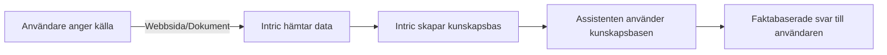

# Vad är crawling?

**Crawling** är en kraftfull process där Intric automatiskt hämtar, bearbetar och indexerar innehåll från olika källor som webbplatser och dokument. Detta gör att AI-assistenter kan söka i och använda detta innehåll för att ge mer relevanta och faktabaserade svar.

{ width="640" loading=lazy }

## Hur fungerar crawling?

Crawling-processen är som att skapa ett digitalt bibliotek för din AI-assistent. När du kopplar en webbplats eller laddar upp filer gör Intric innehållet sökbart så att assistenten kan hitta den mest relevanta informationen för varje fråga.

!!! tip "Tips"
    Crawling är grunden för RAG-teknik (Retrieval-Augmented Generation) som gör att AI-modeller kan svara med aktuell och relevant information även om den inte fanns i modellens ursprungliga träningsdata.

## Metoder för att lägga till innehåll

=== "Webbplats"
    { width="430" loading=lazy }

    1. **Knowledge** → *Websites* → **Connect website**  
    2. Ange URL, välj crawl-typ:
        - **Basic crawl**: För mindre webbplatser
        - **Deep crawl**: För mer omfattande innehållshämtning
    3. Sätt **Automatic updates** (t.ex. *Every week*) för att hålla innehållet aktuellt
    4. Markera **Download and analyse compatible files** för att även indexera PDF-filer från sidan
    5. Klicka **Create website** – status visas som *Synced* när processen är klar

=== "Sitemap-baserad crawling"
    { width="430" loading=lazy }
    
    För större webbplatser kan du använda sitemap-baserad crawling:
    
    1. Ange URL till webbplatsens sitemap (vanligen `exempel.se/sitemap.xml`)
    2. Välj **Sitemap based crawl** 
    3. Detta ger mer precis indexering och följer webbplatsens egen struktur
    
    !!! info "Vad är en sitemap?"
        En sitemap är en XML-fil som listar alla viktiga sidor på en webbplats. Den fungerar som en karta för sökmotorer och andra system (som Intric) att följa.

=== "Filsamling" 
    { width="380" loading=lazy }
    
    1. **Create collection** → namnge samlingen  
    2. **Upload files** – dra och släpp filer (Word, PDF, Excel m.fl.)
    3. Klar! En notification visas: *Analysing…* → *Indexed*
    
    !!! success "Fördelar med filer"
        Filuppladdning är perfekt för intern dokumentation, policydokument, eller annan information som inte finns publikt tillgänglig på webben.

## Praktiskt exempel: Kommuninformation

En kommun kan använda crawling för att göra sin hemsida tillgänglig för sin AI-assistent:

1. Koppla kommunens webbplats med **Deep crawl** och veckovis uppdatering
2. Aktivera **Download and analyse compatible files** för att inkludera formulär, blanketter och informationsbroschyrer
3. Skapa en separat filsamling med interna riktlinjer och handböcker

Nu kan en assistent svara på frågor som:
- "Vad är öppettiderna för återvinningscentralen?"
- "Hur ansöker jag om bygglov?"
- "Vilka förskolor finns i kommunen?"

Assistenten svarar baserat på kommunens egen information istället för generell kunskap.

## Vanliga problem & lösningar

| Problem | Trolig orsak | Lösning |
|---------|--------------|---------|
| Tomt index | Inloggningskrav på sidan | Lägg till inloggningsuppgifter/autentisering |
| Många irrelevanta sidor | För brett crawling-scope | Definiera tillåtna sökvägar (allowed paths) |
| Långsam crawling | Stor webbplats (10 000+ sidor) | Använd sitemap eller begränsa djupet |
| Föråldrad information | Statisk crawling | Aktivera automatiska uppdateringar |

!!! warning "Viktigt att tänka på"
    Crawling bör endast användas för innehåll som din organisation har rättigheter till. Använd inte denna funktion för att indexera upphovsrättsskyddat material utan tillstånd.

---

## Crawling och AI-svar

När en användare ställer en fråga till en assistent som använder crawlat innehåll:

1. Systemet söker igenom den indexerade informationen
2. Relevanta textavsnitt hämtas baserat på frågan
3. AI-modellen formulerar ett svar med hjälp av både sin grundkunskap och den hämtade informationen
4. Svaret refererar till organisationens egna källor snarare än extern information

Detta säkerställer att assistenten ger **korrekta, aktuella och verksamhetsspecifika svar**.

---

### Relaterade ämnen
- [Vad är RAG?](vad-ar-rag.md)
- [Skapa assistenter](../assistenter/skapa-assistenter.md)
- [Koppla kunskapsbaser till assistenter](../assistenter/koppla-kunskapsbaser.md)
