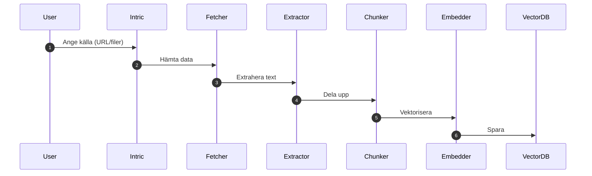

# Vad är crawling?

*Crawling* = automatiskt hämta & indexera innehåll så att AI:n kan söka i det.

{ width="640" }

---

## Steg-för-steg-flöde

---

## Praktiska exempel

=== "Webbplats"
    { width="430" }

    1. **Knowledge** → *Websites* → **Connect website**  
    2. Ange URL, välj *Basic / Deep crawl*  
    3. Klicka **Create website** – status visas som *Synced*.

=== "Filsamling" 
    1. **Create collection** → namnge  
    2. **Upload files** – drag-and-drop  
       { width="380" }
    3. Klar! Notification → *Analysing…* → *Indexed*.

---

## Vanliga problem & lösningar

| Problem | Trolig orsak | Lösning |
|---------|--------------|---------|
| Tomt index | Inloggning krävs | Lägg till credentials |
| Många irrelevanta sidor | För brett scope | Lägg till filter/allowed paths |
| Långsam crawl | 10 000+ sidor | Begränsa djup eller frekvens |

---

### Relaterade ämnen
- [Vad är RAG?](vad-ar-rag.md)
- [Skapa assistenter](../assistenter/skapa-assistenter.md)
