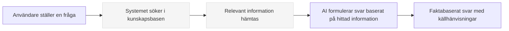

# Vad är RAG?

**Retrieval-Augmented Generation (RAG)** är en teknik som förbättrar AI-modellers svar genom att kombinera informationssökning i externa kunskapskällor med generering av svar. Enkelt uttryckt: RAG hjälper AI att "slå upp fakta" innan den svarar på en fråga.

## Hur fungerar RAG?

RAG-processen kan liknas vid en bibliotekarie som först söker efter relevant information i sitt bibliotek och sedan formulerar ett svar baserat på den hittade informationen.

!!! info "RAG och crawling hänger ihop"
    **Crawling** är _processen som skapar_ kunskapsbasen som RAG använder. Crawling samlar in och indexerar informationen, medan RAG är _tekniken som använder_ denna information för att besvara frågor.

## Fördelar med RAG

!!! success "Varför RAG är viktigt"
    - **Aktuell information**: Ger tillgång till ny information som inte fanns när AI-modellen tränades
    - **Domänspecifik kunskap**: Kan ge svar baserade på din organisations unika information
    - **Färre felaktigheter**: Minskar risken för "hallucinationer" där AI hittar på svar
    - **Spårbarhet**: Kan ange källorna till informationen som använts

## Olika metoder för att ge information till RAG

=== "Kunskapsbaser (crawling/filer)"
    När du skapar kunskapsbaser genom crawling eller filuppladdning:
    
    1. Informationen analyseras och delas upp i mindre delar
    2. Varje del konverteras till en vektorrepresentation (embedding)
    3. Dessa vektorer lagras i en databas för snabb sökning
    4. Vid en fråga söks de mest relevanta delarna fram och används som kontext
    
    **Bäst för**: Stora informationsmängder som webbplatser, rapporter, handböcker

=== "Bilagor (direkt i chatten)"
    { width="300" loading=lazy }
    
    När du bifogar en fil direkt i chatten med **Attach files**-knappen:
    
    1. Hela filen skickas direkt till AI-modellen 
    2. Inget förbearbetas eller lagras i en databas
    3. Modellen kan se hela innehållet på en gång
    
    **Bäst för**: Korta dokument, enkel referensinformation, bilder

!!! warning "Viktigt om bilder"
    RAG fungerar sämre för bilder när de läggs till i kunskapsbaser. Detta beror på att tekniken främst är utformad för text. När en bild läggs till i en kunskapsbas bryts den ned i mindre delar som inte behåller det visuella sammanhanget.
    
    För bilder, använd istället **Attach files**-knappen direkt i chattgränssnittet.

## Jämförelse: RAG vs Bilagor

| Aspekt | RAG (Kunskapsbaser) | Bilagor (direkt i chatten) |
|--------|---------------------|----------------------------|
| Databearbetning | Information delas upp och indexeras | Hela filen skickas obearbetad |
| Informationsmängd | Kan hantera enorma datamängder | Begränsad av modellens kontextfönster |
| Token-kostnad | Låg (endast relevanta delar används) | Högre (hela dokumentet bearbetas) |
| Permanens | Informationen finns tillgänglig i alla konversationer | Endast tillgänglig i den specifika konversationen |
| Användning | Bra för webbplatser, stora dokumentsamlingar | Bra för bilder, korta PDF:er, specifik referensinformation |

## Praktiskt exempel: Handläggare på Försäkringskassan

En handläggare på Försäkringskassan kan använda RAG på olika sätt:

**Via kunskapsbaser (crawling):**
- Alla interna riktlinjer och regelverk indexeras via crawling
- Handläggarens AI-assistent kan svara på specifika frågor om regeltolkningar 
- "Vilka regler gäller för samordning av föräldrapenning och sjukpenning?"

**Via bilagor:**
- Handläggaren kan ladda upp ett specifikt ärende direkt i chatten 
- "Kan du sammanfatta detta ärende och föreslå vilka ytterligare underlag som behövs?"
- Detta håller informationen enbart inom den aktuella konversationen

## Tips för effektiv användning av RAG

1. **Strukturera din information** - Välorganiserad information ger bättre sökresultat
2. **Uppdatera regelbundet** - Ställ in periodiska uppdateringar för dina crawlade webbplatser
3. **Kombinera metoder** - Använd kunskapsbaser för permanent information och bilagor för tillfällig

---

### Relaterade ämnen
- [Vad är crawling?](vad-ar-crawling.md)
- [Skapa assistenter](../assistenter/skapa-assistenter.md)
- [Koppla kunskapsbaser till assistenter](../assistenter/koppla-kunskapsbaser.md)