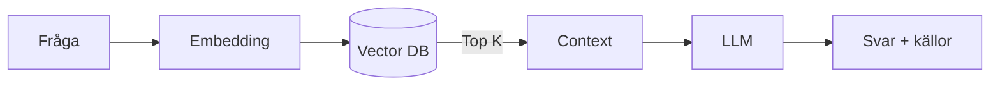

# Vad är RAG?

**Retrieval-Augmented Generation** kombinerar *sökning* och *generering*.

!!! success "Fördelar"
    - Färsk & domän-specifik kunskap  
    - Färre hallucinationer  
    - Källhänvisningar

| RAG | Bilagor |
|-----|---------|
| Svar baseras på valda text­utdrag | Hela filen skickas |
| Låg token-kostnad | Högre kostnad |
| Bra för stora datamängder | Bra för kort referenstext |

---

### Relaterade ämnen
- [Vad är crawling?](vad-ar-crawling.md)
- [Skapa assistenter](../assistenter/skapa-assistenter.md)
