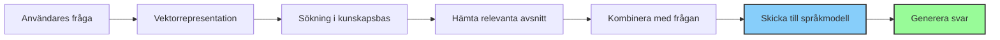

# Vad är RAG?

**Retrieval-Augmented Generation (RAG)** är en teknik som kombinerar informationshämtning med textgenerering för att skapa bättre, mer informerade AI-svar. I Intric används denna teknik för att låta assistenter använda information från dina kunskapskällor.

## Hur RAG fungerar

RAG fungerar i tre huvudsakliga steg:

1. **Indexering:** Dokument och data från dina kunskapskällor analyseras och omvandlas till vektorrepresentationer (matematiska beskrivningar av betydelse).

2. **Hämtning (Retrieval):** När en användare ställer en fråga:
   * Systemet skapar en vektorrepresentation av frågan
   * Letar efter information i kunskapsbasen som liknar frågan
   * Hämtar de mest relevanta textavsnitten

3. **Generering (Generation):** AI-modellen får både:
   * Användarens fråga
   * Den hämtade relevanta informationen
   * Assistentens grundinstruktioner (prompt)

   Utifrån detta skapar modellen ett svar som är baserat på både dess tränade kunskap och den specifika information som hämtats.

## Fördelar med RAG i Intric

RAG erbjuder flera betydande fördelar för organisationer:

!!! success "Uppdaterad kunskap"
    RAG kan använda den senaste informationen även om AI-modellen tränades för länge sedan.

!!! success "Pålitlighet"
    Genom att basera svar på organisationens egna dokument minskar risken för hallucinationer (påhittad information).

!!! success "Källhänvisningar"
    Svaren kan kopplas till specifika dokument och avsnitt i kunskapsbasen, vilket ökar transparensen.

!!! success "Domänkunskap"
    Assistenten kan använda organisationsspecifik information som inte finns i modellens träningsdata.

!!! success "Dataskydd"
    Känslig information behöver inte inkluderas i modellens träning utan kan hållas separat i kunskapsbasen.

## RAG vs. Bilagor i Intric

| **RAG (Knowledge)** | **Bilagor (Attachments)** |
|:-------------------|:------------------------|
| Söker dynamiskt efter relevant information | Skickar hela innehållet med varje prompt |
| Bra för stora datamängder | Lämplig för mindre, kritiska dokument |
| Använder token-ekonomiskt | Kan öka token-användningen betydligt |
| Bra för information som ändras | Bra för statisk referensinformation |

## Relaterade ämnen

- [Vad är crawling?](vad-ar-crawling.md)
- [Hur skapar man assistenter?](../assistenter/skapa-assistenter.md)
- [Hantera kunskapskällor](hantera-kunskapskallor.md)
