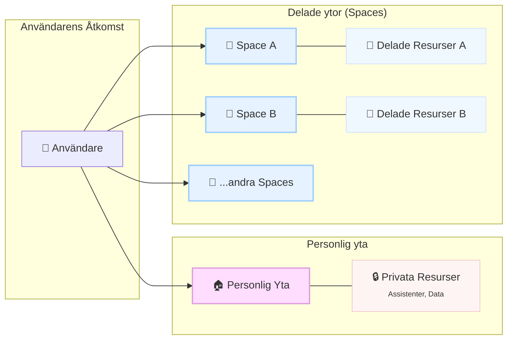

# Vad är ett Space?

Ett **Space** är en **delad arbetsyta** i Intric där ett team kan:

* bygga och testa AI-assistenter tillsammans  
* dela data i en gemensam kunskapsbank  
* styra roller, rättigheter och AI-modeller efter säkerhetsklassning  

> :material-lightbulb-on-outline:{ .md-icon }  
> **Tänk ett Space som ett “projekt-rum”**: alla som bjuds in ser samma assistenter, data och inställningar.

{ width="650" }

---

## Varför använda Spaces?

- :material-account-group:{ .md-icon .lg } **Team-work**  
  Flera personer kan _samtidigt_ bygga och förbättra en AI-tillämpning.

- :material-database-sync:{ .md-icon .lg } **Delad kunskap**  
  En gemensam datakälla = enhetliga svar från assistenterna.

- :material-security:{ .md-icon .lg } **Säkerhets­kontroll**  
  Tillåt bara de AI-modeller som är godkända för projektets data.

- :material-chart-box-outline:{ .md-icon .lg } **Uppföljning**  
  Kommande funktioner ger statistik och regelefterlevnad (AI Act, GDPR).

---

## Så funkar det – snabb översikt

När du klickar in i ett **Space** ser du bara resurser som hör dit – inga personliga assistenter blandas in.

---

## Roller & rättigheter

| Roll            | Kan göra                                                   | Typiskt ansvar |
|-----------------|------------------------------------------------------------|----------------|
| **Admin**       | Skapa/ta bort Spaces, invitera medlemmar, ändra modeller   | Produkt-/team-ägare |
| **Redaktör**    | Ladda upp data, skapa/ändra assistenter                    | Utvecklare, subject-matter-experts |
| **Läsare**      | Använda färdiga assistenter, se data (läsbart)             | Slut­användare, testare |

!!! note
    Roller kan också sättas via **Azure AD-grupper** eller liknande – fråga IT-admin om ni använder gruppsynk.

---

## Skapa ett Space – steg för steg

1. Gå till fliken **Spaces** → klicka **Create space**.  
2. Döp Spacet (ex. *“Samarbetsyta: Ekonomi-bot”*).  
3. (Valfritt) <kbd>Invite members</kbd> och välj roll.  
4. I **Settings** → välj vilka **completion-** och **embedding-modeller** som får användas.  
5. Ladda upp data under **Knowledge** eller skapa nya **assistenter**.

{ width="650" }

---

## Typiskt arbetsflöde

1. **Initiera** – Admin skapar Spacet och sätter säkerhetsnivå.  
2. **Dela data** – Redaktörer laddar upp filer eller kopplar webb-crawl.  
3. **Bygg assistenter** – Alla i teamet itererar på prompt, bilagor och RAG.  
4. **Testa** – Läsare provar, ger feedback via Insights.  
5. **Gå live** – Admin markerar *Production mode* (låser kritiska inställningar).  
6. **Förvalta** – Teamet följer upp statistik och justerar vid behov.

---

## Vanliga frågor

| Fråga | Kort svar |
|-------|-----------|
| **Kan jag flytta en assistent till ett Space?** | Ja – öppna assistenten, **Duplicate → välj Space**. |
| **Hur begränsar jag modeller?** | *Space → Settings → Completion models* – slå av/på per modell. |
| **Går det att ha flera Spaces?** | Obegränsat. Ett för varje projekt, test­miljö eller avdelning. |
| **Blir data publik?** | Nej, data stannar i Spacet och ärvs inte till andra Spaces. |
| **Vad händer om jag tar bort ett Space?** | Allt raderas (assistenter, data, loggar). Exportera först om du vill spara. |

---

## Bästa praxis

* **Ett syfte per Space** – tydlig gräns mellan projekt sparar tid och säkerhets­granskning  
* **Minsta nödvändiga modell‐lista** – slå bara på modeller som uppfyller säkerhets­kraven  
* **Dokumentera prompt & data** – lägg “Läs-mig-först” som bilaga för snabb onboarding  
* **Sätt versionstaggar** – använd *Production mode* när tillämpningen går live  
* **Granska loggar** – utnyttja kommande Insights-fliken för att följa upp kvalitet & regelefterlevnad  

---

## Relaterade ämnen

- [Skillnad mellan personlig yta och Space](funktioner/assistenter/skillnad-personlig-vs-space.md)  
- [Skapa assistenter](../assistenter/skapa-assistenter.md)  
- [Vad är RAG?](../kunskapsbaser/vad-ar-rag.md)  
- [Vad är crawling?](../kunskapsbaser/vad-ar-crawling.md)