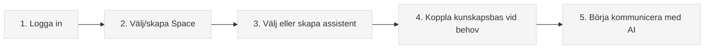

# Välkommen till Intric

**Intric är den öppna AI-plattformen för offentlig sektor**, utvecklad med fokus på säkerhet, transparens och användarcentrerad innovation.

Med Intric kan kommuner, myndigheter och andra offentliga verksamheter tryggt ta del av generativ AI:s möjligheter utan att kompromissa med dataskydd, transparens eller kontroll.

[Kom igång på 5 minuter](kom-igang/vad-ar-en-prompt.md){ .md-button .md-button--primary }

[Utforska funktioner](funktioner/assistenter/vad-ar-en-assistent.md){ .md-button }

{ align=right width="100%" loading=lazy alt="Illustration av Intric plattformen" }

---

## Varför Intric?

* :material-shield-lock:{ .lg .middle } __Säkerhet & kontroll__

    ---
    
    Behåll kontrollen över din data och vilka AI-modeller som används. Anpassa säkerhetsnivåer efter verksamhetens behov och känslighetskrav.
    
    [:octicons-arrow-right-24: Läs om säkerhetsfunktioner](om-intric.md#sakerhet-i-fokus)

* :material-database-search:{ .lg .middle } __Organisationsspecifik kunskap__

    ---
    
    Koppla assistenter till er egen information genom kunskapsbaser. Svaren baseras på er data, era regler och rutiner - inte på generell information från internet.
    
    [:octicons-arrow-right-24: Utforska kunskapsbaser](funktioner/kunskapsbaser/vad-ar-crawling.md)

* :material-account-group:{ .lg .middle } __Samarbete & delning__

    ---
    
    Skapa gemensamma arbetsytor för team och dela AI-resurser inom och mellan organisationer. Bli effektivare tillsammans och undvik att uppfinna hjulet på nytt.
    
    [:octicons-arrow-right-24: Lär dig om Spaces](funktioner/spaces/vad-ar-en-space.md)

* :material-code-json:{ .lg .middle } __Öppen källkod__

    ---
    
    Full insyn i plattformens funktioner och processer. Utvecklad med öppen källkod under MIT-licens så att alla kan bidra till vidareutvecklingen.
    
    [:octicons-arrow-right-24: Se källkoden](https://github.com/sundsvallai/intric){ target="_blank" rel="noopener noreferrer" aria-label="Öppnar GitHub i nytt fönster" }

## Snabbstart för din roll

=== "För nybörjare"

    Om du är ny på Intric eller generativ AI:
    
    1. [Lär dig om prompts](kom-igang/vad-ar-en-prompt.md) - grunden för att kommunicera med AI
    2. [Prova färdiga assistenter](funktioner/assistenter/anvanda-assistenter.md) - se vilka möjligheter som finns
    3. [Förstå Spaces](funktioner/spaces/vad-ar-en-space.md) - din samarbetsyta i Intric

=== "För utvecklare"

    Tekniska resurser för att integrera och anpassa:
    
    1. [API-dokumentation](api-referens.md) - integrera med andra system
    2. [Installation och konfiguration](installation/index.md) - för lokal utveckling
    3. [Säkerhetsinställningar](administration/sakerhet.md) - konfigurera åtkomst

=== "För beslutsfattare"

    Strategiska fördelar och nyttorealisering:
    
    1. [Om Intric](om-intric.md) - bakgrund och vision
    2. [Användningsfall](anvandningsfall/index.md) - exempel från offentlig sektor
    3. [Användarföreningen](om-intric.md#oppen-kallkod-och-samverkan) - samverkan mellan organisationer

## Populära funktioner

* :material-robot:{ .lg } __Skapa assistenter__

    ---

    Designa specialiserade AI-assistenter för olika behov i din verksamhet.
    
    [:octicons-arrow-right-24: Skapa assistenter](funktioner/assistenter/skapa-assistenter.md)

* :fontawesome-solid-spider:{ .lg } __Kunskapsbaser via crawling__

    ---

    Låt AI:n använda information från era webbplatser och dokument.
    
    [:octicons-arrow-right-24: Kom igång med crawling](funktioner/kunskapsbaser/vad-ar-crawling.md)

* :material-message-text:{ .lg } __Effektiv promptning__

    ---

    Lär dig tekniker för att formulera frågor som ger bättre svar.
    
    [:octicons-arrow-right-24: Promptningstekniker](kom-igang/hur-promptar-man.md)

* :material-file-document-plus:{ .lg } __Dokument- och bildanalys__

    ---

    Analysera, sammanfatta och bearbeta dokument och bilder.
    
    [:octicons-arrow-right-24: Dokument & bildanalys](funktioner/dokument-och-bilder/index.md)

## Kom igång på fem minuter

!!! tip "Pro-tips för att komma igång"
    * Utforska först - testa färdiga assistenter innan du skapar egna
    * Börja enkelt - experimentera med grundläggande prompter
    * Använd kunskapsbaser - för verksamhetsspecifika svar
    * Samarbeta - dela effektiva resurser med kollegor via Spaces

---

* :material-help-circle:{ .lg } __Behöver du hjälp?__

    ---
    
    Hittar du inte vad du söker? Vi finns här för att hjälpa till.
    
    [Kontakta support](mailto:digitalisering@sundsvall.se){ .md-button .md-button--primary }

* :material-notebook-edit:{ .lg } __Senaste uppdateringar__

    ---
    
    Håll dig informerad om nya funktioner och förbättringar i plattformen.
    
    [Läs om uppdateringar](nyheter.md){ .md-button }

