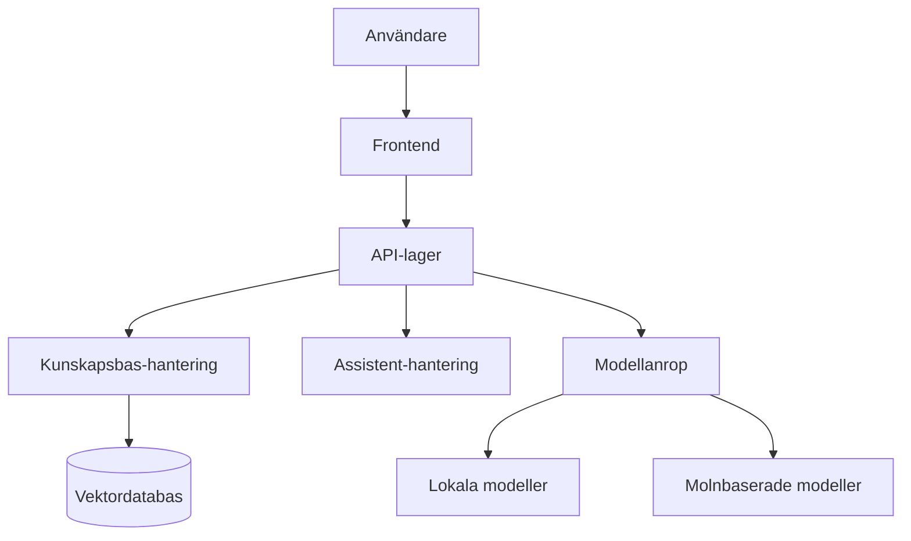

# Om Intric Plattformen

Intric är Sundsvalls kommuns öppna AI-plattform, utvecklad för att möta de specifika behoven hos offentlig sektor när det gäller användning av generativ AI.

- :octicons-shield-lock-16:{ .lg .middle } __Säkerhet i fokus__
  
  Designad med säkerhet som grundprincip – offentliga verksamheters behov står i centrum
  
- :octicons-repo-forked-16:{ .lg .middle } __Öppen källkod__
  
  Full transparens genom MIT-licens och community-drivet samarbete
  
- :octicons-database-16:{ .lg .middle } __Total datakontroll__
  
  Din organisation behåller all kontroll över data och vilka modeller som används
  
- :octicons-tools-16:{ .lg .middle } __Teknikoberoende__
  
  Frihet att använda olika AI-modeller beroende på behov och säkerhetskrav

## Varför Intric?

!!! quote "Vision"
    Att ge alla verksamheter och medarbetare inom offentlig sektor en **jämlik och säker tillgång** till generativ AI.

Medan kommersiella AI-lösningar ofta medför frågetecken kring datasäkerhet, juridik och transparens, erbjuder Intric ett alternativ som är specifikt utformat för offentlig sektors utmaningar.

### Fördelarna med Intric

| Utmaning | Kommersiella lösningar | Intric |
|----------|------------------------|--------|
| **Datasäkerhet** | Data skickas ofta till externa tjänster | All data hanteras i din egen miljö |
| **Transparens** | "Svarta lådor" utan insyn | Öppen källkod med full insyn |
| **Anpassningsbarhet** | Ofta låsta till specifika modeller | Flexibilitet att välja modeller |
| **Kostnadskontroll** | Oförutsägbara prenumerationskostnader | Kontroll över infrastruktur och användning |
| **Regelefterlevnad** | Svårt att säkerställa GDPR-kompatibilitet | Utformad med hänsyn till offentlig sektors regelverk |

## Nyckelfunktioner

=== "Kunskapsbaser :octicons-database-16:"

    Skapa kunskapsbaser från olika källor:
    
    - Ladda upp dokument (PDF, Word, Excel m.fl.)
    - Crawla webbplatser automatiskt
    - Anslut till API:er och databaser
    
    Kunskapsbaserna ger assistenterna tillgång till aktuell och organisationsspecifik information.

=== "AI-assistenter :octicons-copilot-16:"

    Bygg skräddarsydda AI-assistenter för olika behov:
    
    - Anpassa personlighet och expertis med systemprompts
    - Koppla till specifika kunskapsbaser
    - Sätt säkerhetsnivåer och tillgänglighet
    - Analysera användning och prestanda

=== "Samarbetsytor :octicons-people-16:"

    Spaces möjliggör teambaserat arbete:
    
    - Dela assistenter och kunskapsbaser inom team
    - Samarbeta kring utveckling av AI-lösningar
    - Kontrollera behörigheter och åtkomst
    - Bygga gemensamma AI-resurser

=== "Flexibilitet :octicons-stack-16:"

    Teknisk frihet att välja:
    
    - Lokala eller molnbaserade modeller
    - Olika språkmodeller för olika behov
    - Integration med befintliga system
    - Kontinuerlig anpassning till teknikutvecklingen

## Praktiska tillämpningar

!!! example "Exempel på användningsområden"
    - **Interna kunskapschatbots** som kan svara på frågor om policies och rutiner
    - **Medborgarassistenter** för kommunal service och information
    - **Ärendehantering** med automatisk sammanfattning och klassificering
    - **Dokumentanalys** för att extrahera relevant information från stora datamängder
    - **Språkstöd** för att förenkla och förtydliga komplicerade texter

## Öppen källkod och samverkan

Intric är utgiven som öppen källkod under MIT-licens och finns tillgänglig på [GitHub](https://github.com/sundsvallai/intric){ .md-button .md-button--primary target=_blank }.

### Användarförening

En användarförening är under bildande för att främja:

- **Erfarenhetsutbyte** mellan kommuner och andra offentliga aktörer
- **Delning av AI-tillämpningar** för att undvika dubbelarbete
- **Gemensam utveckling** av nya funktioner
- **Best practices** för ansvarsfull AI-användning i offentlig sektor

!!! tip "Bli en del av gemenskapen"
    För att delta i det digitala forumet för utbyte, kontakta [digitalisering@sundsvall.se](mailto:digitalisering@sundsvall.se).

---

## Teknisk arkitektur

Intric är byggd på moderna, öppna teknologier med en modulär arkitektur som möjliggör flexibilitet och skalbarhet.

Detta säkerställer att plattformen kan växa och anpassas efter verksamhetens behov över tid.
